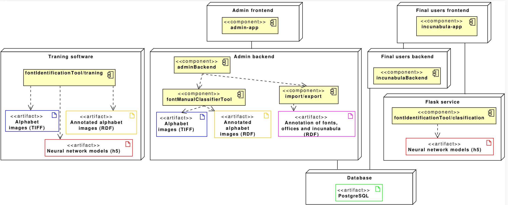

# CACIN: Computer Aided Cataloguing of Incunabula

## Table of Contents <!-- omit in toc -->

- [Introduction](#introduction)
- [Architecture](#architecture)
- [Installation](#installation)
- [Tutorial](#tutorial)
- [References](#references)

## Introduction

The objective of this project is to provide the software tools that facilitate the administration and management of a web application for the cataloguing of incunabula. 

Incunabula are the texts printed mainly during the second half of 15th century that are a key cultural element in a revolutionary period of the history and evolution of the book and the printing. Apart from the typical CRUD operations of a catalogue and the ability to annotate the main the metadata properties of incunabula documents, this catalogue has the ability to automatically identify the typeface used in the printed text by applying the Proctor-Haebler method, which classifies typefaces based on the height of the lines and the shape of the special letters. The identification of the typeface allows the incunabulum to be assigned to the printing office that created that typeface, as well as locating its printing spatially and temporally.

The software makes use of machine learning techniques for the segmentation of pages into lines and characters and for the identification of special characters and their shapes (see Lacasta et al, 2022).

## Architecture

The architecture of the project presented is shown in the following figure:



According to the components of this architecture, the repository is organized in four different parts:

#### fontIdentificationTool  
This part performs the complete typography recognition process starting by accepting a page and outputting a resulting font.

####  IncunabulaBackend
This part related to the backend of expert/normal user 
####  incunabula-app
This part is the application of our website
####  incunabulaAdmin
This part is responsible for admin web application.


## Installation

This Open Source project has the following software requirements:

- [PostgreSQL](https://www.postgresql.org/)
- [Docker](https://docs.docker.com/get-docker/)
- [Anaconda](https://www.anaconda.com/download)
  

For the deployment of the web site that provide access to the catalogue of incunabula, you should follow this order in the deployment of the different components:

1. IncunabulaBackend
2. incunabula-app
3. fontIdentificationTool

All the deployment details that you need are available in the subfolder of each component.

In addition, if you want to deploy and run the admin tools, you can have a look at the folder  **incunabulaAdmin** .

### Deployment of the catalogue as a Docker container

The pretrained data used in the 'fontIdentification' folder can be accessed through the following URL:

[Model](https://unizares-my.sharepoint.com/:f:/g/personal/hala_neji_unizar_es/EutSZY0C-ZVEq-6iBOhGlyUBbMvjxubWTtuS5PIcrk7iqA)

Download the folder and place it in the following directory: fontIdentificationTool/data/output/ 

Next, run the following command to create the Docker containers and start the application:


```
docker compose up --build
```

## Tutorial

At this link you will see how [the catalogue can be deployed as a web application](https://cacin.iaaa.es/).

In addition, you can watch the following video:

[](https://youtu.be/v49EJ7qHKJ4)

## References
- J. Lacasta, J. Nogueras-Iso, F.J. Zarazaga-Soria, M.J. Pedraza-Gracia (2022). [Tracing the origins of incunabula through the automatic identification of fonts in digitised documents](https://doi.org/10.1007/s11042-022-13108-3). Multimedia Tools and Applications, 81:40977–40991

[![CC BY 4.0][cc-by-image]][cc-by]

[cc-by]: http://creativecommons.org/licenses/by/4.0/
[cc-by-image]: https://i.creativecommons.org/l/by/4.0/88x31.png
[cc-by-shield]: https://img.shields.io/badge/License-CC%20BY%204.0-lightgrey.svg
